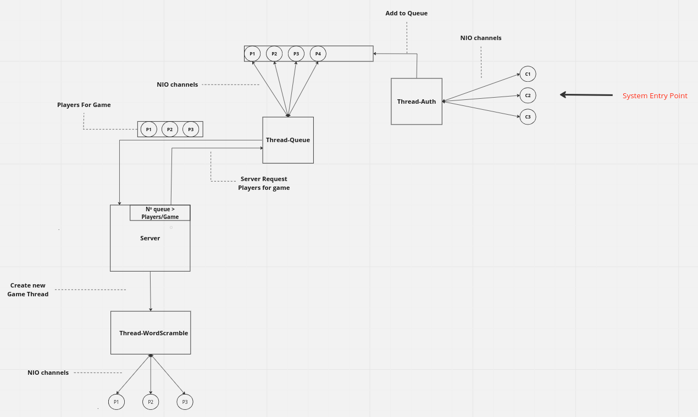
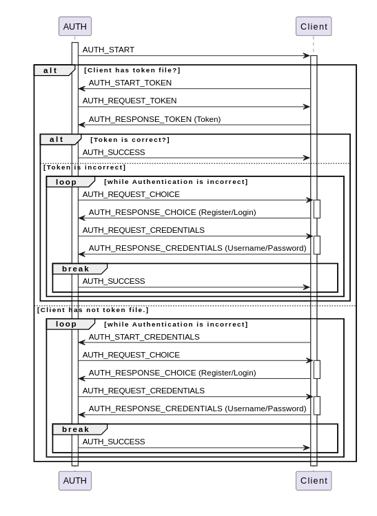
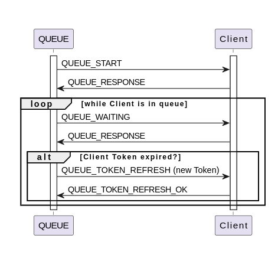
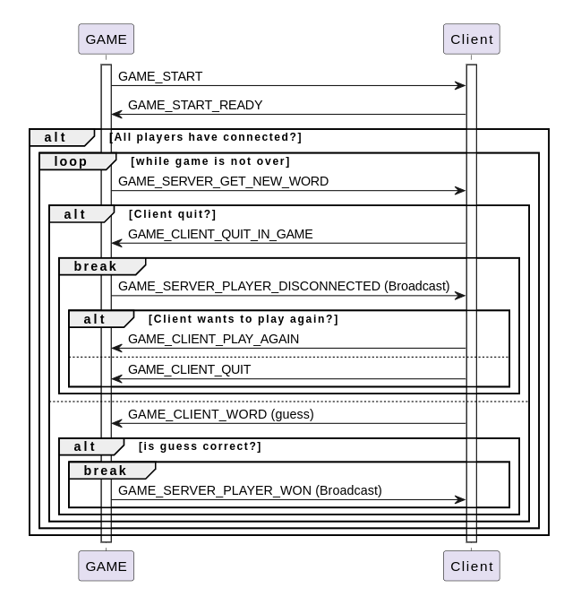

# G15 - 2nd CPD Project

## COMPILE & RUN INSTRUCTIONS:

To compile the project, you need to run the following command from the src directory: **javac cpd/g15/wordScramble/*.java**

To run the project, you need to do the following steps:
- start up the server by running the following command: **java cpd.g15.wordScramble.Server (port) (gameMode: 1 - simple // 2 - ranked) (Nº Players per game)**

- connect a client to the server by running the command: **java cpd.g15.wordScramble.Client (port) (clientNumber)**

NOTE: The (clientNumber) argument is used to identify the client and for token file storage.

## IMPLEMENTED GAME:

For this project we implemented a simple text-based game called WordScramble. During each match, the server sends to the players a scrambled word for them to guess all at the same time. The first player who guesses the word wins.

In this game, there's two game modes:

- Simple: There's no ranking system involved. During the match making, the player selection criteria is based on the time that each player arrived at the queue.
- Ranked: In this game mode, we implemented an ELO based ranking system. The players accumulate a certain amount of points, reflective of their game performance. There are 3 ranks:
	- Bronze (the player has less than 801 points)
	- Silver (the player has more than 801 and less than 951 points)
	- Gold (the player has more than 951 points)

For the matchmaking process, we implemented an algorithm that is divided into the following steps:
- Select the first player from the queue
- Iteratively choose the next (n-1) players from the queue (being n the number of players allowed per match)
- Check if the ELO difference between the players is acceptable. If it's under a certain value, then create a new game with the players in question. If the difference is not acceptable, do this process for the next player in the queue.
- If, after a certain amount of time, there's still players on the waiting queue, the acceptable ELO difference between the players will be multiplied by a factor (relaxation).

After each match, the ELO of the players is updated: if a player wins, their ELO increases 100 points. If they lose, it decreases 50 points.

## ARCHITECTURE:

From the picture above, we can clearly see that the implemented architecture is divided into four main parts:
- Server, responsible for creating the Auth and Queue threads and constantly checking if there are a minimum number of players (for a match) in queue. When the latter happens, a Game thread is created.
- Authentication, made up of an Auth (authentication) Thread. This thread has the main functions of being the **System's Entry Point**, where the clients connect, and dealing with the authentication processes (login and register, for example). It also has the task of, after they have logged in, adding the players to the waiting queue.
- Waiting Queue, which consists of a Queue Thread that has the players' waiting queue. One of the main tasks of this thread is to allocate players to a game match.
- Game, that has a Game thread that handles the overall gaming experience for each match. 

## SUB-PROTOCOLS:

In order to ease the communication between the client and the server, we implemented a Message Class that has a certain **Type**, depending on the client's state (in Auth, in Queue or Playing), and an **Object**, that is transferred between them. In this class we also have two main methods:
- **readObject**, that creates a buffer to allocate 4 bytes. This buffer will correspond to the actual message size. After reading the message size, a new buffer is allocated to read the actual message's content.
- **writeObject**, responsible for converting the message into a byte buffer, and determines the buffer size to create a new 4 byte buffer that holds the message's size. Finally, the two buffers are merged into a new buffer that is sent to the client's channel.

With this in mind, we developed the following messaging protocols:

- **Client-AUTH**

- **Client-QUEUE**

- **Client-GAME**

## FAULT TOLERANCE

One of the main challenges of this project was to implement a robust fault tolerance system. After a player logs in, they are placed in a queue, waiting for a game to start. However, if the player's connection goes down, they should be able to rejoin and don't lose their position in the waiting queue.

With this in mind, we created a token based system. After a player successfully registers, the server creates a specific token that is associated with the player in question. Consequently, this token gives the server the ability to not only authenticate the player without the need of them inputting their username/password, but also to reallocate them to their original spot on the queue, after they disconnected during waiting time. Also, there's two factors that need to be addressed:
- After a certain amount of time, the player's token refreshes, is replaced by a new one and is sent to the client. 
- If the player disconnects from the queue and doesn't reconnect after a certain amount of time OR the player enters a match, their token expires. As a consequence, if the player tries to log in again, they'll have to enter with their own username & password, which then leads to the creation of a new token.

In addition to this, to avoid keeping "dead" players in the waiting queue, we decided to constantly check if there are any players that aren't logged in AND have an expired token. In these cases, the players are removed from the queue and disconnected.

## CONCURRENCY

To guarantee thread concurrency and synchronization in our project, we created two main locks:
- **lockPlayerDB**, to control the access to the player database
- **lockPlayerQueue**, to handle the access to the waiting queue

These implemented locks are ReentrantReadWrite locks, which means that they not only allow a thread to acquire the same lock multiple times, but also allow various threads to read a certain resource (but only one to write it).

## AVOID SLOW CLIENTS

To avoid keeping slow players in the waiting queue, we decided to create a timeout system that stores the client's last received message time. Constantly, the system checks if there are any players which the time of the last message received plus a certain timeout constant is lower than the current time.

## CLIENT INPUT

In order to read from the input when needed and receive messages from the server, we decided to create a new thread that deals with the client input. This thread has a queue of inputs that, when the client receives from the system .in, it adds the input to the queue in question.

When the client is in game, if the server requests a word, the client will check on the auxiliary thread if there is any input available. In case there is, the client will deal with this message. Otherwise, the message will be added to a priority queue. This queue stores all the messages while in game and sorts them, giving priority to game terminating messages (**GAME_SERVER_CORRECT_WORD, GAME_SERVER_PLAYER_WON, GAMER_SERVER_PLAYER_DISCONNECTED**). This way, when someone wins the match, the players automatically receive the option to play again, without needing to enter an input again.

## TEST CASES

**Username // Password // Ranking**
- moreira - 1234 - 1000 (Gold)
- anto - 1234 - 960 (Gold)
- hugo - 1234 - 940 (Silver)
- bot1 - 1234 - 400 (Bronze)
- bot2 - 1234 - 400 (Bronze)
- bot3 - 1234 - 400 (Bronze)
- bot4 - 1234 - 100 (Bronze)

**Ranking algorithm tests**
- *Have similar ELO* - moreira, anto, hugo
- *1 high ELO and 3 low ELO* - moreira, bot1, bot2, bot3
- *3 different ELO* - moreira, bot1,bot4